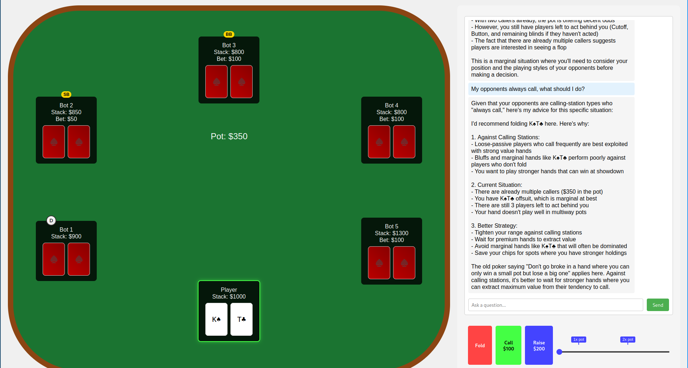

# Poker Tutor

An interactive poker learning tool that uses LLMs to provide real-time feedback and teaching during poker hands.



## Features

- Interactive web-based poker interface
- Real-time game state updates
- LLM-powered analysis and feedback
- Poker solver integration for optimal play comparison (TODO)
- WebSocket-based communication

## Setup

1. Ensure you have Python 3.13+ and Conda installed
2. Activate the conda environment:
   ```bash
   conda activate ./poker_env
   ```

3. Install dependencies:
   ```bash
   pip install -r requirements.txt
   ```

4. Create a `.env` file with your OpenRouter API key:
   ```
   OPENROUTER_API_KEY=your_api_key_here
   ```

## Running the Application

1. Start the server:
   ```bash
   python run.py
   ```

2. Open your browser and navigate to:
   ```
   http://localhost:8000
   ```

## Project Structure

- `poker_tutor/`
  - `poker_engine/`: Core poker game logic
  - `server/`: FastAPI server and WebSocket handling
  - `solver/`: Poker solver integration (TODO)
  - `llm/`: OpenRouter LLM integration
- `static/`: Frontend assets
  - `css/`: Stylesheets
  - `js/`: JavaScript files